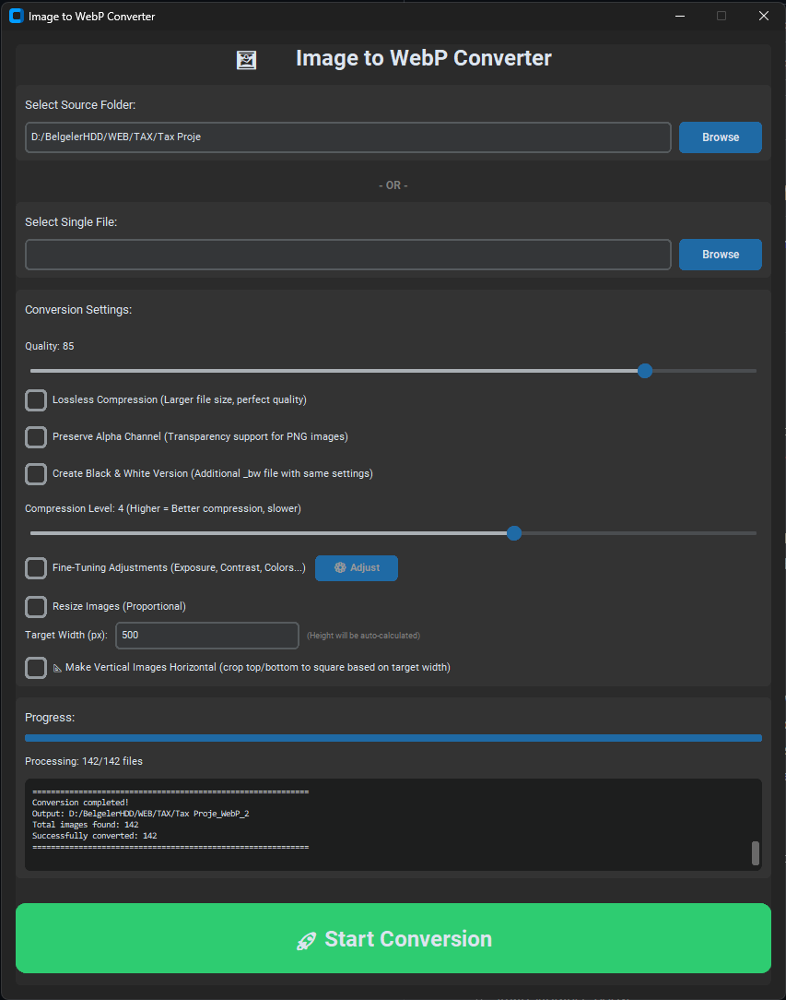
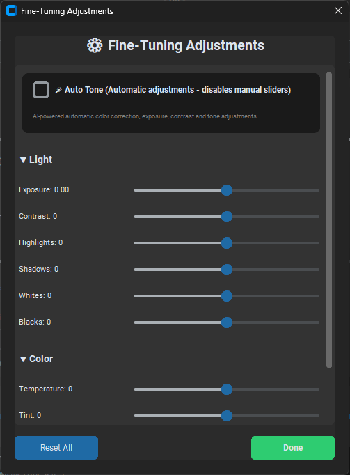

# 🖼️ Image to WebP Converter

[](https://www.python.org/downloads/)
[](https://github.com/burakdarende/ToWebP)
[](LICENSE)
[](https://github.com/TomSchimansky/CustomTkinter)
[](https://python-pillow.org/)
[](https://github.com/burakdarende/ToWebP/stargazers)

Modern, feature-rich GUI application for converting images to WebP format with advanced editing capabilities and folder structure preservation.

## 📸 Screenshots

<p align="center">
  
  <br>
  <em>Main Interface - Modern dark theme with comprehensive conversion options</em>
</p>

<p align="center">
  
  <br>
  <em>Fine-Tuning Dialog - Professional editing controls with Auto Tone and manual adjustments</em>
</p>

## ✨ Key Features

### 🎨 Modern Interface

- **Beautiful Dark Theme UI** - Intuitive and professional interface built with CustomTkinter
- **Real-time Progress** - Live conversion progress with detailed logging
- **Responsive Design** - Optimized window layout for better usability

### 🔄 Conversion Options

- **Multiple Format Support** - Convert JPG, PNG, BMP, TIFF, GIF to WebP
- **Folder & Single File** - Process entire folders or individual files
- **Smart Versioning** - Automatic version numbering (\_WebP_2, \_WebP_3) for repeated conversions
- **Stop Anytime** - Interrupt conversion process with visual feedback

### 📐 Image Processing

- **Resize Images** - Proportional resizing with target width
- **Make Horizontal** - Auto-crop vertical images to square format
- **Alpha Channel Control** - Preserve or remove transparency
- **Black & White Versions** - Automatically create grayscale copies

### 🎨 Advanced Editing (Fine-Tuning)

- **Auto Tone** - AI-powered automatic color correction (Photoshop-style)

  - Auto levels and contrast
  - Highlight recovery
  - Shadow enhancement
  - White balance correction
  - Smart vibrance boost

- **Manual Adjustments** - Professional editing controls:
  - 📊 Exposure (-2.0 to +2.0)
  - 📊 Contrast (-100 to +100)
  - ☀️ Highlights (-100 to +100)
  - 🌙 Shadows (-100 to +100)
  - ⚪ Whites (-100 to +100)
  - ⚫ Blacks (-100 to +100)
  - 🌡️ Temperature (-100 to +100)
  - 🎨 Tint (-100 to +100)
  - 🌈 Vibrance (0 to +100)
  - 🎨 Saturation (-100 to +100)

### ⚙️ Quality Settings

- **Quality Control** - Adjustable quality (1-100)
- **Lossless Mode** - Perfect quality preservation
- **Compression Level** - Fine-tune compression (0-6)
- **Folder Structure Preservation** - Maintains exact hierarchy

### 💻 Platform Support

- **Cross-Platform** - Windows, macOS, Linux
- **Standalone Executable** - No Python installation required
- **Fast Processing** - Optimized conversion engine

## 🚀 Quick Start

### Option 1: Run from Source (Recommended for Development)

1. **Clone the repository:**

```bash
git clone https://github.com/burakdarende/ToWebP.git
cd ToWebP
```

2. **Install dependencies:**

```bash
pip install -r requirements.txt
```

3. **Run the application:**

```bash
python gui.py
```

### Option 2: Build Standalone Executable

#### Windows:

```powershell
# Install dependencies
pip install -r requirements.txt
pip install pyinstaller

# Build
.\build.ps1

# Or use Python script
python build_exe.py

# Find executable at: dist/ImageToWebP.exe
```

#### macOS:

```bash
# Install dependencies
pip3 install -r requirements.txt
pip3 install pyinstaller

# Make build script executable
chmod +x build.sh

# Build
./build.sh

# Or use Python script
python3 build_exe.py

# Find app at: dist/ImageToWebP.app
```

#### Linux:

```bash
# Install dependencies
pip3 install -r requirements.txt
pip3 install pyinstaller

# Build
python3 build_exe.py

# Find executable at: dist/ImageToWebP
```

## 📖 User Guide

### Basic Workflow

1. **Select Source**

   - Click "Browse Folder" for batch conversion
   - OR click "Browse File" for single file
   - Selection is mutually exclusive

2. **Configure Settings**

   **Quality Settings:**

   - Quality: 1-100 (recommended: 75-85)
   - Lossless: Enable for perfect quality
   - Compression: 0-6 (4 is balanced)

   **Image Processing:**

   - Preserve Alpha: Keep transparency
   - Create B&W: Generate grayscale versions
   - Resize: Enable proportional resizing
   - Make Horizontal: Crop vertical images to square

   **Fine-Tuning:**

   - Enable fine-tuning checkbox
   - Click "Open Fine-Tuning Adjustments"
   - Choose Auto Tone or manual adjustments
   - Reset anytime with "Reset All" button

3. **Start Conversion**

   - Click "🚀 Start Conversion"
   - Monitor progress in real-time
   - Click "⛔ STOP" to interrupt if needed

4. **Check Results**
   - Output location shown in log
   - Folders: `[folder]_WebP` (versioned if exists)
   - Files: `filename.webp` (versioned if exists)

### Fine-Tuning Dialog

**Auto Tone (Recommended for Quick Edits):**

- ✅ Enable "🪄 Auto Tone" checkbox
- Automatically adjusts:
  - Exposure and contrast
  - Highlights and shadows
  - White balance
  - Color vibrance
- Manual sliders are disabled when active

**Manual Adjustments (Advanced Users):**

- Disable Auto Tone
- Adjust individual parameters:
  - **Exposure**: Overall brightness
  - **Contrast**: Difference between lights and darks
  - **Highlights**: Bright areas
  - **Shadows**: Dark areas
  - **Whites**: Brightest tones
  - **Blacks**: Darkest tones
  - **Temperature**: Warm (yellow) ↔ Cool (blue)
  - **Tint**: Green ↔ Magenta
  - **Vibrance**: Boost muted colors
  - **Saturation**: Overall color intensity

### Processing Order

Images are processed in this sequence:

1. Resize (if enabled)
2. Make Horizontal crop (if enabled)
3. Alpha channel adjustment
4. Fine-tuning (Auto Tone or Manual)
5. WebP conversion
6. Black & White version (if enabled, always last)

## 📂 Output Structure Examples

### Folder Conversion

**Input:**

```
C:/MyPhotos/
├── 2023/
│   ├── summer/
│   │   ├── beach.jpg
│   │   └── sunset.png
│   └── winter/
│       └── snow.jpg
└── family.jpg
```

**First Conversion → Output:**

```
C:/MyPhotos_WebP/
├── 2023/
│   ├── summer/
│   │   ├── beach.webp
│   │   └── sunset.webp
│   └── winter/
│       └── snow.webp
└── family.webp
```

**Second Conversion → Output:**

```
C:/MyPhotos_WebP_2/
├── 2023/
│   ├── summer/
│   │   ├── beach.webp
│   │   └── sunset.webp
│   └── winter/
│       └── snow.webp
└── family.webp
```

### Single File Conversion

**Input:** `photo.jpg`

**Outputs:**

- First conversion: `photo.webp`
- Second conversion: `photo_WebP_2.webp`
- Third conversion: `photo_WebP_3.webp`

**With B&W enabled:**

- First: `photo.webp` + `photo_bw.webp`
- Second: `photo_WebP_2.webp` + `photo_bw_WebP_2.webp`

## 🛠️ Technical Details

### Supported Input Formats

- JPEG (.jpg, .jpeg)
- PNG (.png)
- BMP (.bmp)
- TIFF (.tiff, .tif)
- GIF (.gif)

### Technologies Used

- **Python 3.8+** - Core language
- **Pillow 10.0+** - Image processing and manipulation
- **NumPy 1.24+** - Advanced pixel-level operations for fine-tuning
- **CustomTkinter 5.2+** - Modern dark-themed GUI framework
- **PyInstaller** - Standalone executable creation

### System Requirements

**For Running from Source:**

- Python 3.8 or higher
- 4GB RAM minimum (8GB recommended for large images)
- 100MB free disk space

**For Standalone Executable:**

- No Python installation required
- Same RAM requirements
- OS: Windows 7+, macOS 10.12+, Linux (Ubuntu 18.04+)

## 💡 Tips & Best Practices

### Recommended Settings by Use Case

**Web Optimization:**

```
Quality: 75-80
Lossless: OFF
Compression: 4
Resize: ON (1920px or 1200px)
```

**Photography Archive:**

```
Quality: 90-100
Lossless: ON
Compression: 6
Preserve Alpha: ON
Fine-Tuning: Auto Tone ON
```

**Logo/Graphics:**

```
Quality: 100
Lossless: ON
Compression: 6
Preserve Alpha: ON
```

**Social Media:**

```
Quality: 75
Lossless: OFF
Compression: 3
Resize: ON (1080px)
Make Horizontal: ON (for Instagram)
```

**Quick Processing:**

```
Quality: 70
Lossless: OFF
Compression: 0
Fine-Tuning: OFF
```

### File Size Comparison (Average)

- **PNG → WebP (Quality 80):** 60-80% reduction
- **JPG → WebP (Quality 80):** 20-40% reduction
- **BMP → WebP (Quality 80):** 90-95% reduction
- **Lossless WebP vs PNG:** 25-35% reduction

### Performance Benchmarks

Processing 1000 images (5MB each):

- **Compression 0:** ~2-3 minutes
- **Compression 4:** ~4-5 minutes
- **Compression 6:** ~6-8 minutes
- **With Fine-Tuning:** +20-30% time
- **With Resize:** +10-15% time

## 🔧 Development

### Project Structure

```
ToWebP/
├── gui.py              # Main GUI application (800+ lines)
├── converter.py        # Core conversion engine (600+ lines)
├── build_exe.py        # Universal build script
├── build.ps1           # Windows PowerShell build script
├── build.sh            # macOS/Linux bash build script
├── start.bat           # Windows quick start
├── start.ps1           # Windows PowerShell quick start
├── start.sh            # macOS/Linux quick start
├── requirements.txt    # Python dependencies
├── README.md          # This file
├── KULLANIM.md        # Turkish usage guide
└── PROJECT_INFO.md    # Detailed project information
```

### Key Components

**gui.py:**

- Main application window
- Settings controls
- Fine-tuning dialog (scrollable)
- Progress tracking
- Thread management for non-blocking conversion

**converter.py:**

- Image processing engine
- Fine-tuning algorithms:
  - Auto tone with histogram analysis
  - Manual tone curve adjustments
  - Temperature and tint color grading
  - Vibrance and saturation
- Resize and crop logic
- Alpha channel handling
- Version management

### Building from Source

```bash
# Install dependencies
pip install pillow>=10.0.0 customtkinter>=5.2.0 numpy>=1.24.0

# For building executables
pip install pyinstaller

# Build
python build_exe.py

# The script automatically detects your OS and creates appropriate package
```

### Quick Start Scripts

**Windows:**

```powershell
.\start.ps1   # or start.bat
```

**macOS/Linux:**

```bash
chmod +x start.sh
./start.sh
```

## 🔒 Privacy & Security

- ✅ **No Internet Required** - 100% offline processing
- ✅ **No Data Collection** - Zero telemetry or tracking
- ✅ **Safe Processing** - Original files never modified
- ✅ **Local Only** - All processing happens on your machine
- ✅ **Open Source** - Fully transparent code

## ⚠️ Important Notes

### Folder Naming

- Only the **root output folder** gets `_WebP` suffix
- **Subdirectories** keep their original names
- Automatic versioning prevents overwriting

### File Handling

- **Non-image files** in folders are copied as-is
- **Original files** are never deleted or modified
- **Output files** are always new copies

### Memory Usage

- Large images (>50MB) may require significant RAM
- Batch processing thousands of images needs 4GB+ RAM
- Fine-tuning adds ~20% memory overhead

### Alpha Channel

- **Preserved** when "Preserve Alpha" is enabled
- **Removed** (white background) when disabled
- B&W versions maintain alpha if original has it

### Make Horizontal Feature

- Only works when **Resize is enabled**
- Crops **vertical images** (height > width) to square
- Target dimension: Same as target width
- Crops equally from **top and bottom** (centered)

## 🐛 Troubleshooting

### Application Won't Start

**Issue:** GUI doesn't open

```bash
# Solution: Reinstall dependencies
pip install -r requirements.txt --force-reinstall

# Check Python version
python --version  # Must be 3.8+
```

### Conversion Fails

**Issue:** Error during conversion

- ✅ Check source folder/file exists
- ✅ Verify file format is supported
- ✅ Ensure write permissions for output location
- ✅ Check available disk space
- ✅ Try with smaller batch first

### Build Executable Fails

**Issue:** PyInstaller errors

```bash
# Solution 1: Clean install
pip uninstall pyinstaller
pip install pyinstaller

# Solution 2: Use virtual environment
python -m venv venv
source venv/bin/activate  # or venv\Scripts\activate on Windows
pip install -r requirements.txt
pip install pyinstaller
python build_exe.py
```

### macOS Security Warning

**Issue:** "App is damaged" or "App can't be opened"

```bash
# Solution: Remove quarantine attribute
xattr -cr dist/ImageToWebP.app

# Or: Allow in System Preferences
# Settings > Privacy & Security > Open Anyway
```

### Fine-Tuning Not Working

**Issue:** Adjustments not applied

- ✅ Ensure "Enable Fine-Tuning" checkbox is checked
- ✅ Verify values are not all at 0
- ✅ Check if Auto Tone is enabled (disables manual sliders)
- ✅ Look for error messages in log

### Out of Memory

**Issue:** Crash with large images

- ✅ Process fewer images at once
- ✅ Disable fine-tuning for large batches
- ✅ Increase system virtual memory
- ✅ Close other applications

## 📄 License

This project is open source and available under the MIT License for personal and commercial use.

## 🤝 Contributing

Contributions are welcome! To contribute:

1. Fork the repository
2. Create a feature branch (`git checkout -b feature/AmazingFeature`)
3. Commit your changes (`git commit -m 'Add some AmazingFeature'`)
4. Push to the branch (`git push origin feature/AmazingFeature`)
5. Open a Pull Request

### Development Guidelines

- Follow PEP 8 style guide
- Add comments for complex logic
- Test on multiple platforms if possible
- Update README for new features

## 🆘 Support

Need help? Here's how to get support:

1. **Check Documentation:**

   - README.md (this file)
   - KULLANIM.md (Turkish guide)
   - PROJECT_INFO.md (technical details)

2. **Search Issues:**

   - Check existing GitHub issues
   - See if your problem was already solved

3. **Create New Issue:**

   - Describe the problem clearly
   - Include error messages and logs
   - Mention your OS and Python version
   - Attach screenshots if relevant

4. **Community:**
   - Star ⭐ the project if you find it useful
   - Share with others who might benefit

## 🎯 Roadmap

Future features under consideration:

- [ ] Batch preset profiles
- [ ] Custom output folder selection
- [ ] AVIF format support
- [ ] Watermarking option
- [ ] Compare before/after preview
- [ ] Drag & drop support
- [ ] Multi-language UI
- [ ] Scheduled/automated conversion
- [ ] Cloud storage integration

## 📊 Statistics

- **Lines of Code:** 1,400+
- **Features:** 25+
- **Supported Formats:** 5 input formats
- **Platforms:** 3 (Windows, macOS, Linux)
- **Dependencies:** 3 core packages

## 🙏 Acknowledgments

- **Pillow** team for excellent image processing library
- **CustomTkinter** for modern UI framework
- **PyInstaller** for executable packaging
- **NumPy** for advanced mathematical operations
- All contributors and users of this project

## 📧 Contact

- **Repository:** [github.com/burakdarende/ToWebP](https://github.com/burakdarende/ToWebP)
- **Issues:** [github.com/burakdarende/ToWebP/issues](https://github.com/burakdarende/ToWebP/issues)
- **Author:** Burak Darende

---

**Made with ❤️ for easy and professional WebP conversion**

_Star ⭐ this repository if you found it helpful!_
